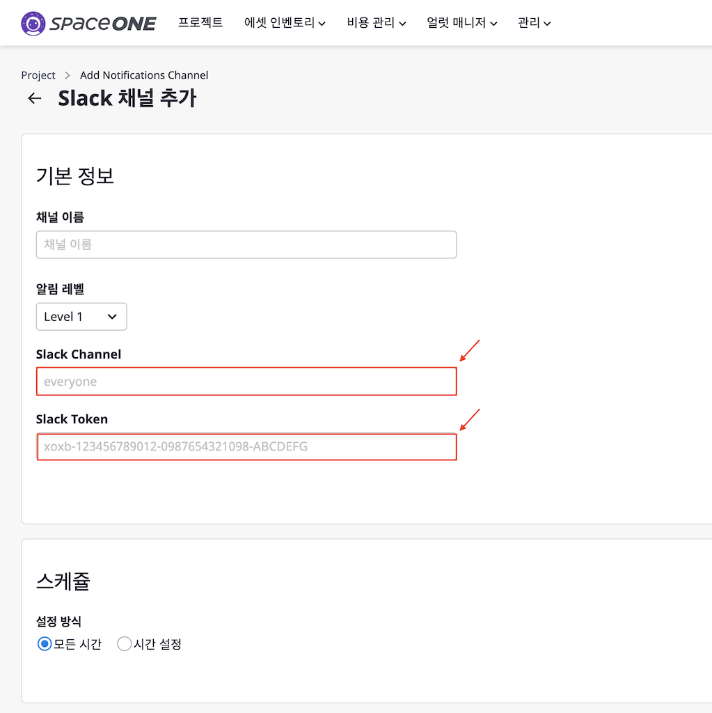

## Slack 채널 추가

---

클라우드포레에서 Slack 플러그인을 사용하기 위해서 [**Slack Channel**], [**Slack Token**]에 대한 설정이 필요합니다.  
본 설정 가이드는 두 가지 설정 정보를 획득하는 방법을 자세히 알아보도록 하겠습니다.

**Slack Bot 사용에 익숙하지 않은 사용자는 1번 가이드를 참고 하십시오.**  
**Slack에서 Channel에 bot을 추가하는 것에 익숙한 사용자는 2번 가이드를 참고 하십시오.**

1. [Slack Bot을 처음 사용하는 사용자를 위한 가이드](./beginner-guide.md)
2. [Slack Bot에 익숙한 사용자를 위한 가이드](./experienced-guide.md)