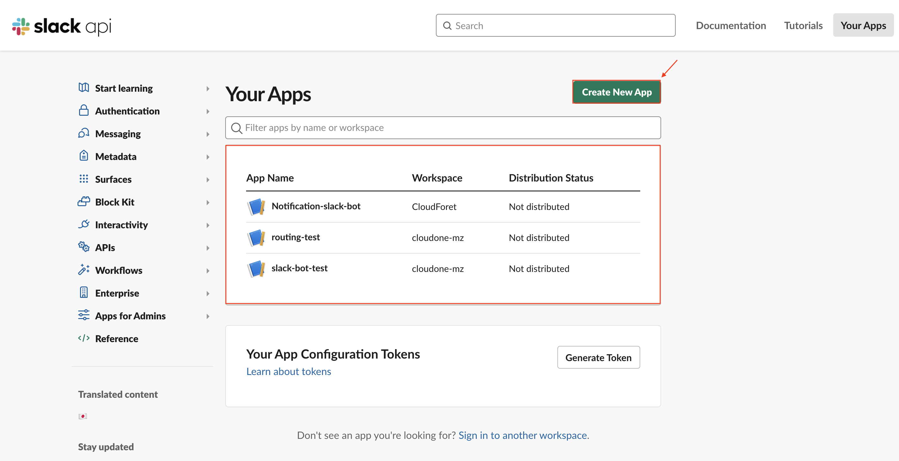
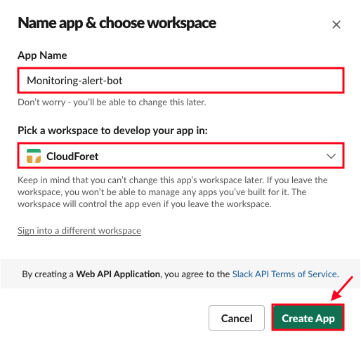
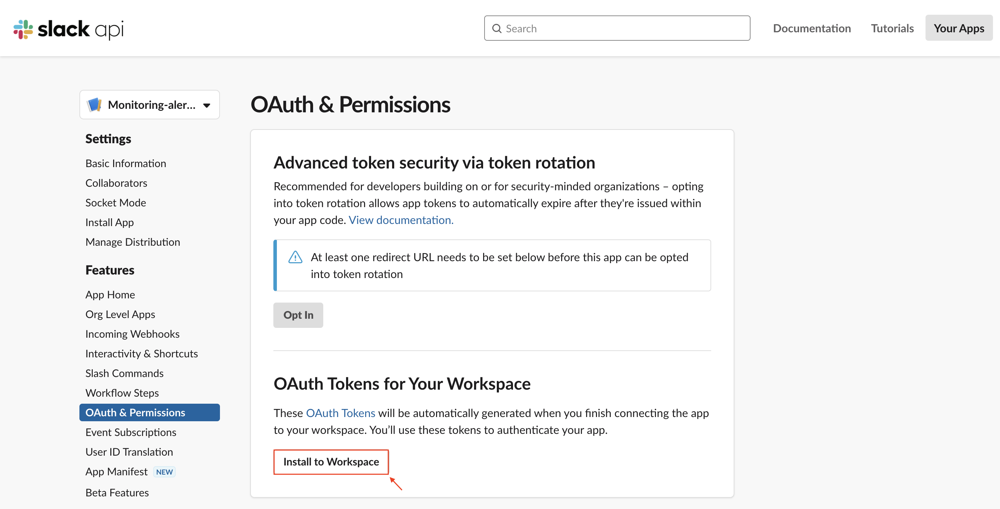
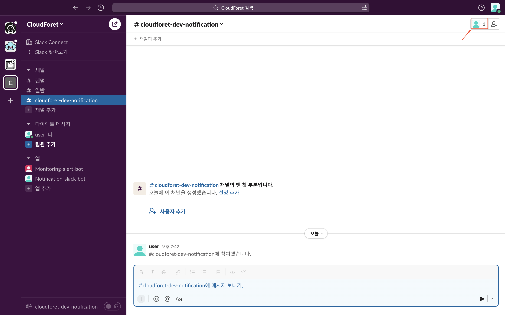
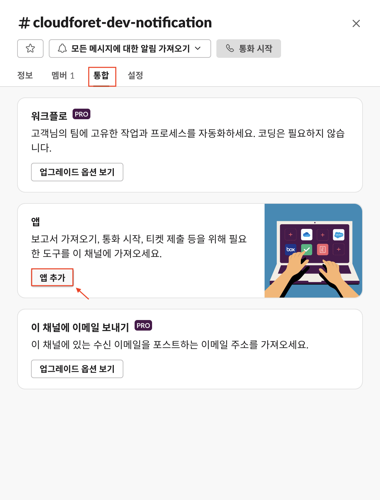
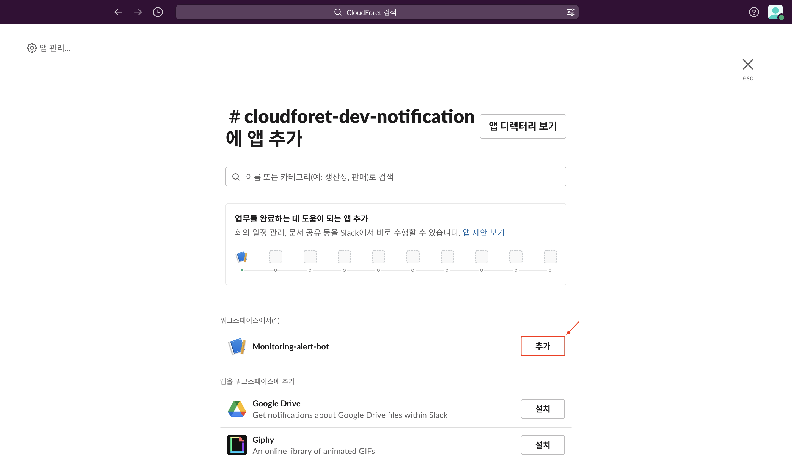
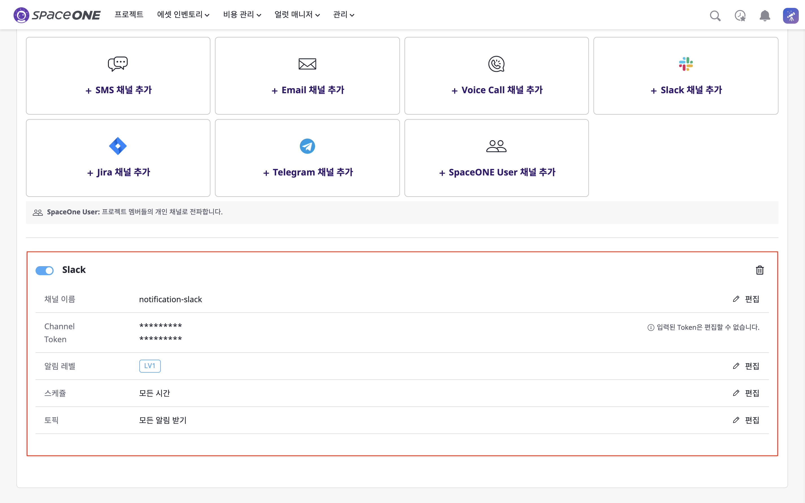

## Slack 채널 추가

클라우드포레에서 Slack 플러그인을 사용하기 위해서 [**Slack Channel**], [**Slack Token**]에 대한 설정이 필요합니다.  
본 설정 가이드는 두 가지 설정 정보를 획득하는 방법을 자세히 알아보도록 하겠습니다.

## 전체 Flow

위의 두 설정을 획득하기 위해 먼저, **전체 Flow**를 간략히 알아보도록 하겠습니다.  

Slack API를 통해 커스텀 APP을 만듭니다. APP을 본인의 Slack 워크스페이스에서 사용할 수 있도록  
권한을 부여한 뒤 토큰을 발행합니다. 발행된 토큰은 slack 워크스페이스에 커스텀 APP을 연동할 때 필요합니다.  
이후, 사용할 Slack Channel에 APP을 추가하면 Slack에서 클라우드포레의 Alert을 수신 받을 수 있습니다.

위의 Flow를 아래의 순서로 더 자세히 알아보도록 하겠습니다. **순서에 맞게 설정을 진행**해야 합니다.

1. [Slack App 생성](./GUIDE.md/#1.-Slack-App-생성)
2. [Slack 워크스페이스와 App 연동](./GUIDE.md/#2.-Slack-워크스페이스와-App-연동)
3. [Slack Channel에 App 추가](./GUIDE.md/#3.-Slack-Channel에-App-추가)
4. [클라우드포레의 Slack 플러그인 사용](./GUIDE.md/#4.-클라우드포레의-Slack-플러그인-사용)

## 1. Slack App 생성

Slack api( https://api.slack.com/apps )에서 Slack에서 사용할 수 있는 App을 만들 수 있도록 지원하고 있습니다.

(1) Slack api 사이트에 로그인 후 상단의 [Your Apps] 버튼을 클릭합니다.

(2) 사용중인 App이 없을 경우 [Create New App] 버튼을 클릭합니다.  
- 사용중인 App이 있을 경우 table에서 선택 후 [2. Slack Token 발행하기](./GUIDE.md/#2.-Slack-워크스페이스와-App-연동)를 진행합니다.

(3) 모달이 열리면 [From scratch]를 선택합니다.

(4) [App Name]을 작성하고 사용할 워크스페이스를 선택 후 [Create App] 버튼을 클릭합니다.

(5) 생성된 App은 https://api.slack.com/apps 에서 확인할 수 있습니다.

## 2. Slack 워크스페이스와 App 연동

앞 서 App을 생성하였으며 생성된 App을 Slack과 연동하기 위해 Slack Token을 발행합니다.  
하지만 Slack Token을 발행하기 전 Slack 워크스페이스에서 사용할 **App의 권한**을 먼저 설정해야 합니다.

### 2.1 권한 설정

(1) Features에 있는 [OAuth & Permissions]을 선택합니다. 권한이 설정되어 있지 않아 OAuth Tokens for Your Workspace의 [Install to Workspace] 버튼은 **비활성화 상태**입니다.

(2) OAuth & Permissions 페이지 하단의 Scopes까지 스크롤하고 Bot Token Scopes의 [Add an OAuth Scope] 버튼을 클릭합니다. 여러 권한 중 `chat:write` 권한을 부여합니다.

- 필요에 따라 Bot의 권한을 변경할 수 있습니다. 
`chat:write` 는 Alert이 발생했을 때 slack channel에 Alert 메세지를 작성하기 위해 필요한 권한입니다.

### 2.2 Token 발행

(3) 앞 서 권한이 설정됨에 따라 OAuth Tokens for Your Workspace의 [Install to Workspace] 버튼은 활성화 되었습니다. 이제 활성화된 버튼을 클릭합니다.

(4) [허용] 버튼을 클릭하여 사용하고자 하는 Workspace와 연동할 수 있게 합니다.

(5) 생성된 [Bot User OAuth Token]을 확인할 수 있습니다. **클라우드포레의 slack 플러그인에 사용되는 Slack Token이 이에 해당합니다.**

## 3. Slack Channel에 App 추가

위의 과정을 통해 **Slack Channel**과 **Slack Token** 두 가지 설정 중 **Slack Token**에 대한 준비는 끝났습니다

이제, Slack에 만든 App을 추가하고 사용하고자 하는 Slack Channel에 Bot을 추가합니다.

(1) Slack 플러그인에 사용할 Slack Channel을 선택하고 Channel 정보를 볼 수 있는 [프로필] 버튼을 클릭합니다.

(2) 띄어진 모달에서 [통합] > [앱 추가] 버튼을 클릭합니다.

(3) 이전에 생성한 `Monitoring-alert-bot`인 App을 확인할 수 있으며 [추가] 버튼을 클릭합니다.

(4) Monitoring-alert-bot Channel에 봇이 추가된 것을 확인할 수 있습니다.

## 4. 클라우드포레의 Slack 플러그인 사용

이제 모든 설정이 끝났습니다. 위의 가이드에 따르면 아래 두 가지 필요한 값을 모두 설정할 수 있습니다.

- **Slack Channel** : 실제 사용하고자 하는 Channel 이름
- **Slack Token** : 권한 설정 이후 App에서 만든 Bot Token

(1) 위의 가이드에 따라 획득한 설정 정보를 넣어 준 후 [생성] 버튼을 클릭합니다.

(2) [알림] 탭에서 slack으로 Alert을 수신받을 수 있도록 추가된 것을 확인할 수 있습니다.

(3) 테스트 Alert을 발생시키면 Slack에서 아래 그림과 같이 확인할 수 있습니다.

